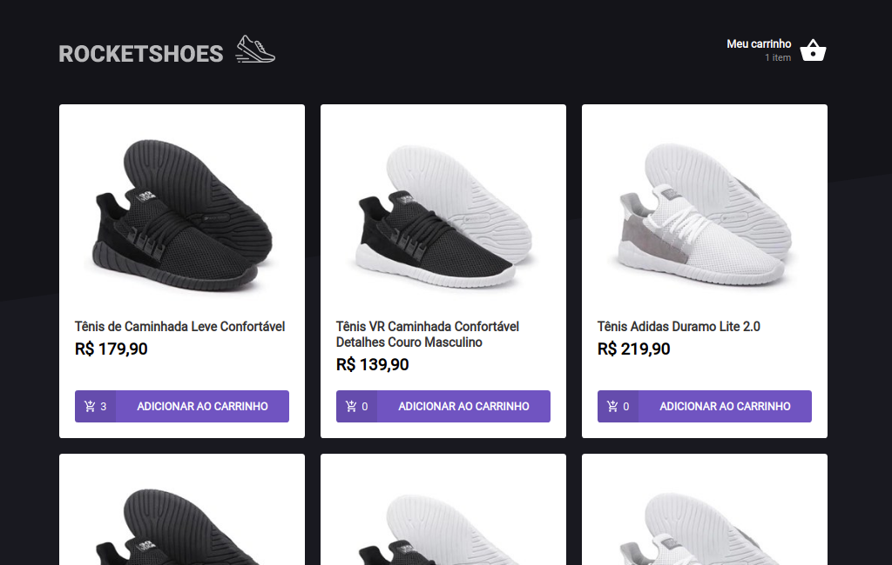
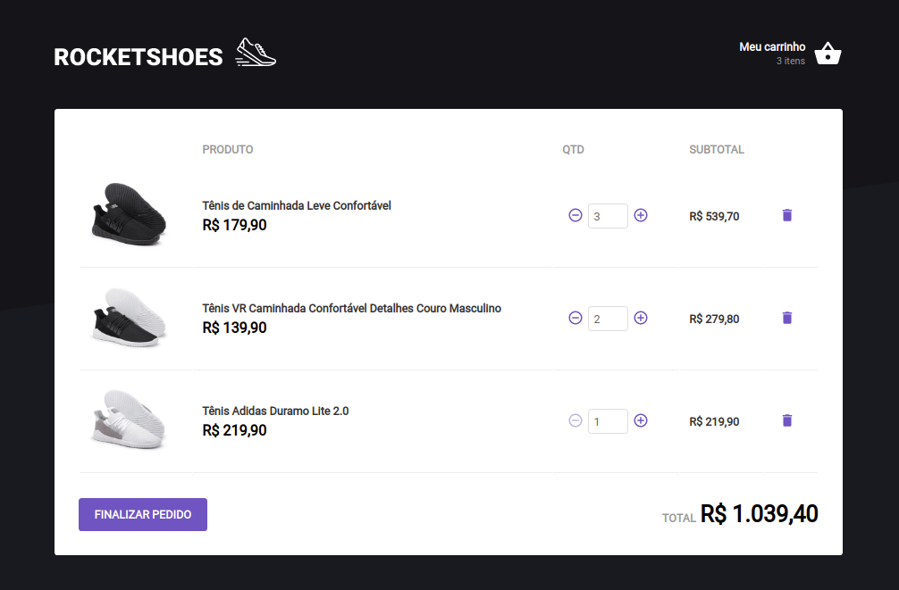

<h1>RocketShoes</h1>
Aplicação prática de loja virtual de calçados.
Desenvolvido durante o Ignite da rocketseat.

## 🚀 Tecnologias

Esse projeto foi desenvolvido com as seguintes tecnologias:

- [React]
- [JsonServer]

## 💻 Projeto

  <h4>Features:</h4>
  <ul>
    <li>Dashboard de apresentação dos produtos, cada produto mantém a sua quantidade enviada para o carrinho de compras, o botão adicionar produto faz o auto-incremente caso o produto já esteja no carrinho</li>
    <li>Carrinho de compras, mantém todos os produtos e suas quantidades selecionadas. Faz o cálculo do subtotal e total da compra </li>
  </ul>

## 🔖 Layout

<table>
  <tr>
    <td><strong>Dashboard</strong></td>
    <td><strong>Carrinho</strong></td>
  <tr>
   <tr>
    <td></td>
    <td></td>
  <tr>
</table>

## Licença

Esse projeto está sob a licença MIT.

Execute yarn install ou npm install para instalação.
